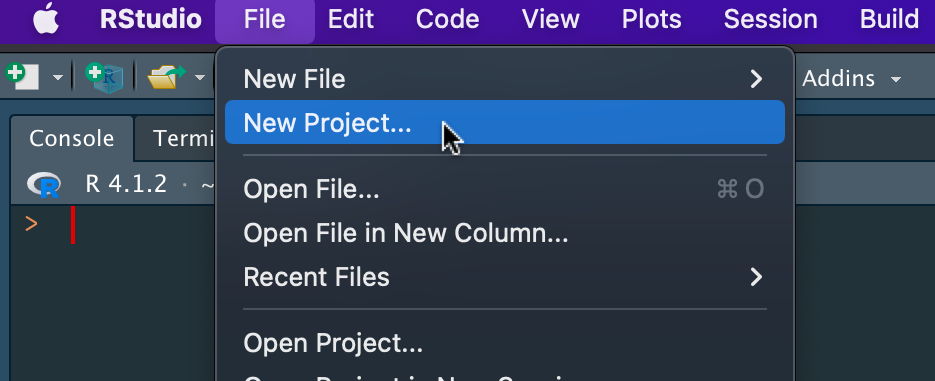
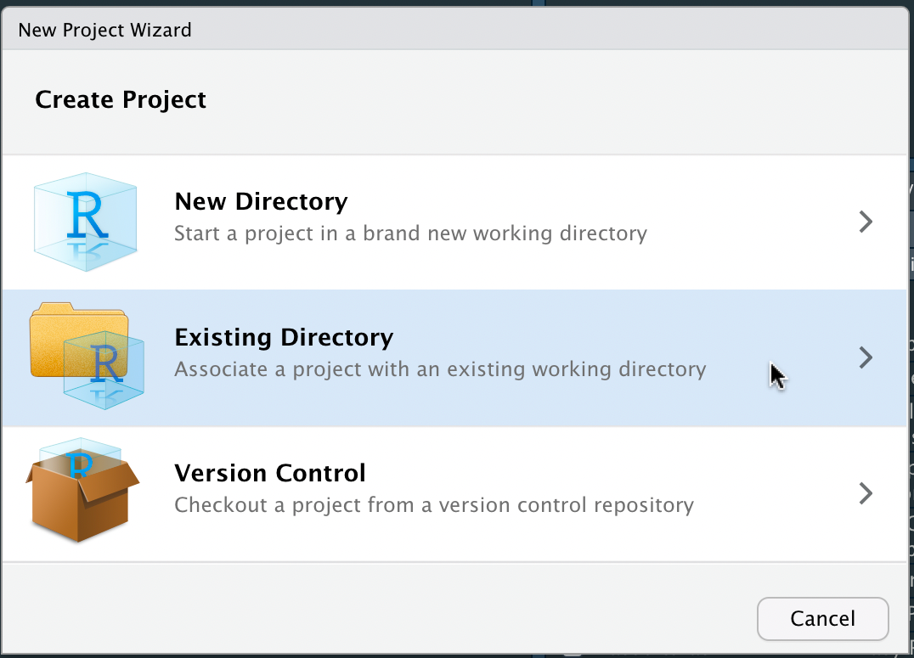

# R code

```{r setup, include=FALSE}
knitr::opts_chunk$set(echo = FALSE, fig.align = "center")
```

## File formats

- As per the study definition best practice, outputs from the cohortextractor should be provided as `.rds` files

- Use the **readr** package to read and write `.rds` files 

    ``` r
    object <- readr::read_rds(file.path("output", "mydata.rds"))
    readr::write_rds(object, 
                     file.path("output", "mydata.rds"),
                     compress = "gz")
    ```  
    
<!--
  - Alternatively, use the **vroom** package, the `vroom::vroom()` function has the `col_sel` argument
-->
    
- All `.rds` files should all be classified as `highly_sensitive` in actions, as they cannot be opened on the results server and therefore cannot be reviewed or released.
- `readr::write_rds()` does not compress files by default. It is recommended that you compress .rds files using the argument `compress = "gz"`.
- Use `file.path()` to construct file paths that are reproducible across operating systems.

## Supported packages

- The R packages (and their version number) which are installed in the OpenSAFELY R Docker container are listed [here](https://github.com/opensafely-core/r-docker/blob/master/packages.csv)
- To request a new package, which should be on CRAN, open a new issue [here](https://github.com/opensafely-core/r-docker/issues), including the link to its CRAN webpage

## RStudio project

- Define your repo as an RStudio project in RStudio as follows
  - File | New Project...  
    ```{r}
    
    ```  
  - Existing Directory  
    ```{r}
    
    ```  
  - Then find your repo
  - This will create a `.Rproj` file at the top level of your repo
  - Commit the file into your repo
  - Now you can double click the `.Rproj` file to open the repo in RStudio, so you can work on your R scripts more conveniently
