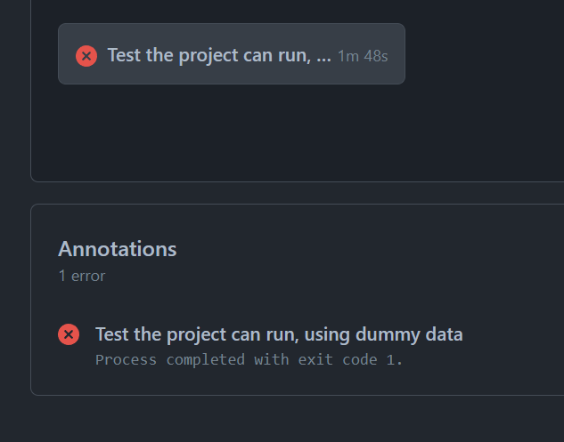

# Outputs for release


All outputs for release should be classified as `moderately_sensitive` in actions. OpenSAFELY does not permit information relating to between 1 and less than 5 individuals to be released. Redaction functions are available from other users to help you prepare your output.

## Tables

  - Use `readr::write_csv()` to save `.csv` files that will be sent to output checkers (this is about twice as fast as `utils::write.csv()` and does not write row names).

    ``` r
    readr::write_csv(object, file = file.path("output", "mydata.csv"))
    ```  
  - Do not save outputs to subdirectories of the `output` folder, otherwise running the study definition on GitHub Actions will probably fail with an error message such as  
    <!-- -->
    ```
    Error in file(file, ifelse(append, "a", "w")) : 
       cannot open the connection
     Calls: write.csv -> eval.parent -> eval -> eval -> write.table -> file
     In addition: Warning message:
     In file(file, ifelse(append, "a", "w")) :
       cannot open file '/workspace/output/descriptive/tables/table1.csv': No such file or directory
     Backtrace:
     1: file(file, ifelse(append, "a", "w"))
     2: write.table(table1_all$table_body, here::here("output", "descriptive", 
     3: eval(expr, p)
     4: eval(expr, p)
     5: eval.parent(Call)
     6: write.csv(table1_all$table_body, here::here("output", "descriptive",

    Error: Process completed with exit code 1.
    ```  
    
## Figures

- Use `.svg` for figure outputs that will be sent to output checkers
- Where applicable (e.g., histograms), start the *x*-axis at 5 instead of 0 to ensure low counts are not exported

## Releasing output

- Ensure your outputs are in the correct formats 
  - `.csv` (not `.rds` or `.Rdata`) for tables of data
  - `.txt` or `.html` if you want to view them in L4
- Ensure your outputs are marked as `moderately_sensitive` in your `project.yaml`
- To release an output, please complete the 'Output files for review' section of [this form](https://docs.opensafely.org/documents/OpenSAFELY_Output_Review_Form_15_11_21.docx) and email to your assigned Bristol L4 access person
- Bristol L4 access people will check the output on the server on your behalf, complete the rest of the form (including files locations), and email to datarelease@opensafely.org for final approval

<!--
## Jupyter and Rmd notebooks

- If you use a Jupyter notebook create a folder called `notebooks` at the top level of your repo
  - Only use Python code chunks within the notebook
  - The action to compile the notebook will be of the form

    ``` yaml
      generate_notebook:
        run: jupyter:latest jupyter nbconvert /workspace/analysis/report.ipynb --execute --to html --template basic --output-dir=/workspace/output --ExecutePreprocessor.timeout=86400 --no-input
        needs:
        outputs:
          moderately_sensitive:
            notebook: output/report.html
    ```

- If you use an R Markdown notebook within your repo create a folder called `rmarkdown` at the top level of the repo
  - In the YAML header of the .Rmd file define the output type as `output: html_document`
  - Write a separate .R script that runs a single command 
  
    ``` r
    rmarkdown::render('myrmdfile.Rmd', encoding = 'UTF-8') 
    ```  
  - And write an `r` action to run the script which will produce the .html output file
-->
