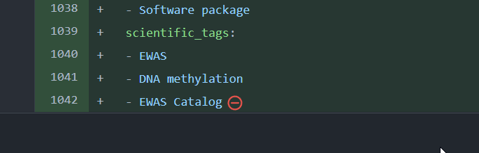

```{r setup, include=FALSE}
knitr::opts_chunk$set(echo = FALSE)
```

## Introduction 

The following is intended as a set of tips for users of the OpenSAFELY system at the University of Bristol.

## Best practice guide{.tabset .tabset-pills .tabset-fade} 

### Study definition

#### Reproducibile dummy data

- To ensure the dummy data system generates exactly the same data every time you run it, set a random number generator seed at the top of the `study_definition.py` file

    ``` python
    import numpy as np
    np.random.seed(123456) # change this number to one for which your scripts successfully run on the dummy data
    ```

#### File formats

- Use `.feather` files for outputs from the cohortextractor, so specify an action in your `project.yaml` as follows

    ``` yaml
    generate_study_population:
      run: cohortextractor:latest generate_cohort --study-definition study_definition --output-format feather
     needs: 
      - design
      outputs:
        highly_sensitive:
          cohort: output/input.feather
    ```  
- Use the **arrow** package to read `.feather` files into R 
  
    ``` r
    arrow::read_feather(file = file.path("output", "input.feather"))
    ```  
  - The `col_select` argument can be used to read in just the columns you need   

- Start each project with a preprocessing action that formats `.feather` files and outputs (gzipped) `.rds` files which can be saved with `readr::write_rds()`
  
    ``` r
    readr::write_rds(object, file.path("output", "mydata.rds"), compress = "gz")
    ```  

### R code

#### File formats

- As per the study definition best practice, outputs from the cohortextractor should be provided as `.rds` files

- Use the **readr** package to read and write `.rds` files 

    ``` r
    object <- readr::read_rds(file.path("output", "mydata.rds"))
    readr::write_rds(object, file.path("output", "mydata.rds"), compress = "gz")
    ```  
    
<!--
  - Alternatively, use the **vroom** package, the `vroom::vroom()` function has the `col_sel` argument
-->
    
- All `.rds` files should all be classified as `highly_sensitive` in actions, as they cannot be opened on the results server and therefore cannot be reviewed or released.
- `readr::write_rds` does not compress files by default. It is recommended that you compress .rds files using the argument `compress = "gz"`.
- Use `file.path` to construct file paths that are reproducible across operating systems.

#### Supported packages

- The R packages (and their version number) which are installed in the OpenSAFELY R Docker container are listed [here](https://github.com/opensafely-core/r-docker/blob/master/packages.csv)
- To request a new package, which should be on CRAN, open a new issue [here](https://github.com/opensafely-core/r-docker/issues), including the link to its CRAN webpage

#### RStudio project

- Define your repo as an RStudio project in RStudio as follows
  - File | New Project...  
    ```{r}
    knitr::include_graphics("img/rstudio-newproject-1.png")
    ```  
  - Existing Directory  
    ```{r}
    knitr::include_graphics("img/rstudio-newproject-2.png")
    ```  
  - Then find your repo
  - This will create a `.Rproj` file at the top level of your repo
  - Commit the file into your repo
  - Now you can double click the `.Rproj` file to open the repo in RStudio, so you can work on your R scripts more conveniently

### Outputs for release

All outputs for release should be classified as `moderately_sensitive` in actions. OpenSAFELY does not permit information relating to between 1 and less than 5 individuals to be released. Redaction functions are available from other users to help you prepare your output.

#### Tables

  - Use `readr::write_csv()` to save `.csv` files that will be sent to output checkers (this is about twice as fast as `utils::write.csv` and does not write row names).

    ``` r
    readr::write_csv(object, file = file.path("output", "mydata.csv"))
    ```  
    
#### Figures

- Use `.svg` for figure outputs that will be sent to output checkers
- Where applicable (e.g., histograms), start the *x*-axis at 5 instead of 0 to ensure low counts are not exported

#### Releasing output

- To release an output, please complete the 'Output files for review' section of [this form](https://docs.opensafely.org/documents/OpenSAFELY_Output_Review_Form_15_11_21.docx) and email to your assigned Bristol L4 access person
- Bristol L4 access people will check the output on the server on your behalf, complete the rest of the form (including files locations), and email to datarelease@opensafely.org for final approval

<!--
### Jupyter and Rmd notebooks

- If you use a Jupyter notebook create a folder called `notebooks` at the top level of your repo
  - Only use Python code chunks within the notebook
  - The action to compile the notebook will be of the form

    ``` yaml
      generate_notebook:
        run: jupyter:latest jupyter nbconvert /workspace/analysis/report.ipynb --execute --to html --template basic --output-dir=/workspace/output --ExecutePreprocessor.timeout=86400 --no-input
        needs:
        outputs:
          moderately_sensitive:
            notebook: output/report.html
    ```

- If you use an R Markdown notebook within your repo create a folder called `rmarkdown` at the top level of the repo
  - In the YAML header of the .Rmd file define the output type as `output: html_document`
  - Write a separate .R script that runs a single command 
  
    ``` r
    rmarkdown::render('myrmdfile.Rmd', encoding = 'UTF-8') 
    ```  
  - And write an `r` action to run the script which will produce the .html output file
-->

### Miscellaneous

- Text files should end with a newline character (i.e., a blank line)
  - If you see the following red icon at the end of a file on GitHub, simply press <kbd>`r knitr::asis_output('\U21B5')` Enter</kbd> at the end of the file (i.e., in this case after the `Catalog`), resave, commit, and the red icon should be gone  
    ```{r}
    
    ```  
- Python and R versions
  - The versions of Python and R in their respective OpenSAFELY Docker containers are (as of `r format(Sys.time(), '%d %B %Y')`):
    - Python 3.8.10
    - R 4.0.2
  - The Python and R code run within their respective Docker containers. Hence the version of Python and R used to run your analyses are the versions of Python and R in these Docker containers and *not* the versions of Python and R on your computer
  - To see the Python version number insert in your `study_definition.py`
  
    ``` python
    import sys
    print(sys.implementation.version)
    ```  
  - To see the R version number insert into one of your R analysis scripts  
  
    ``` r
    print(R.version.string)
    ```  
